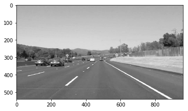
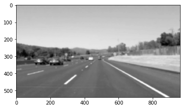
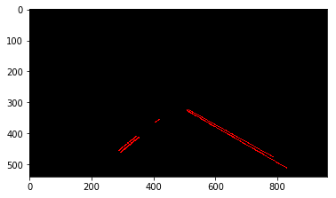

# **Finding Lane Lines on the Road** 

## **Summary**

When we drive, we use our eyes to decide where to go.  The lines on the road that show us where the lanes are act as our constant reference for where to steer the vehicle.  Naturally, one of the first things we would like to do in developing a self-driving car is to automatically detect lane lines using an algorithm.

In this project you will detect lane lines in images using Python and OpenCV.  OpenCV means "Open-Source Computer Vision", which is a package that has many useful tools for analyzing images.  

Here's the [code](https://github.com/udacity/CarND-LaneLines-P1/blob/master/P1.ipynb) of the project. It follows the requirements described in the [project rubric](https://review.udacity.com/#!/rubrics/322/view)

---

## Reflection

### 1. Describe your pipeline. As part of the description, explain how you modified the draw_lines() function.

###

**Pipeline**
1. Grayscale: this step converts the source image to grayscale. From three (rgb) channels down to one. I utilize the `ccvtColor` function from OpenCV.

2. Gaussian smoothing: this step enhances the image by suppressing noise and removing odd gradients. It does so by filtering the image with a Gaussian blur. Kernel size is a parameter. 

3. Canny Edge Detection: in this step the Canny edge detector function from OpenCV is applied to the image. The desired output will contain the edges in the image. 

4. Define region of interest: If we consider the point of view of a camera mounted on a car, the lines from the lane will always be contained within a trapezoidal area. We can safely ignore edges positioned outside this area. In this step I defined the trapezoid defined by bottom, top and height as percentages of the image width and height.

5. Mask edges: I then apply a Hough Transform to detect lines from Canny the edges.
 

6. Draw lines: The final step of the pipeline is to draw the lines. After that an overlay of the lines is placed on top of the source image for visualization purpose.

---

**Drawing lines algorithm**

1.`draw_lines_linear_regression`

My first modification of the original `draw_lines` considered only "valid" lines for each side (i.e. left and right) and calculated the left and right lines using linear regression.

* Calculated the slope of the each segmented line and ignored the ones that:
  * The absolute of slope were <= 0 or >= 1 (avoiding egde cases like vertical lines, etc)
  * The absolute of slope was below an arbitrary threshold inclination (e.g. 0.5)
* Determined the side (left/right) of each line by its position relative to the vertical center of the image and its inclination (positive/negative).
* Used linear regression to estimate the slope of a single line .
* Extrapolated the line start and end `y` values to be at top and bottom of the region of consideration (trapezoid).

The `draw_line_linear_regression` works decently with the test videos. The calculated lines from each frame cause a bit of a jerk movement during the video. This is probably caused by some extreme edges affect the interpolation.

Click for video (linear regression)

---

2. `draw_lines_means`

My second attempt to optmize the `draw_lines` function was `draw_lines_means`. In this function, I kept the same criteria for selecting the line segments to be considered. However, interad of calculating a linear regression I computed the mean values of each  `m` and `b`line coeficients `y = m*x+b`. Using the mean value for `m` and `b` I plotted the line using the same extrapolation used in the previous function.

Click for video (mean coefficients)

This method somehow worked better with the challenge video, it avoided some odd cases that the linear regression didn't work as well. I made another modification to avoid a few seconds where the lines disappeared. (That was when the color of the road changed). I indentified a frame where there was no valid lines to be computed and used the same line of the previous frame. While not perfect, it allowed continuity during that segment of the video.

Click for challenge video (mean coefficients)

### 2. Identify potential shortcomings with your current pipeline

The current pipeline considers that the region of consideration is static. It also considers that the edges or lines are straight. This works for roads where the curves aren't too sharp. 

Another shortcoming could be that the algortihm works best when the texture of the road doesn't change too much. We see in the Challenge video that patches of different colors will confuse the edge finding functions. In this case using the same parameters in the pipeline for every frame of a video might not work well.

Also in the challenge video there's a situation in which another car on another lane that's close enough to fall inside the region of considerartion could introduce false lane edges, given the contrast of its color with the color of the road.

### 3. Suggest possible improvements to your pipeline

The jerky movement of the line from frame to frame could be attenuated if I ignored line segments that fall outside the standard distribition.
Another potential improvement could be to start considering the lines from the previous frames. At 24 fps is certain that the lane will not change beyond a certain angle even in high speeds. Somehow find a way to smooth the change of direction of the line based on the previous frames line. 

### For all the videos please go to my Youtube channel
https://www.youtube.com/playlist?list=PLeSrtBHs-jC3xld0DEnDlzbHwMZEsC4JA

